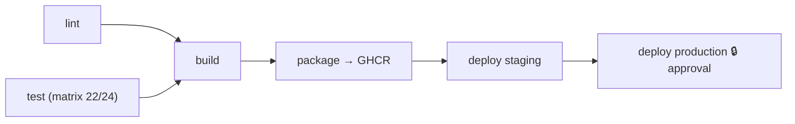

# Lab 8 — CI/CD Capstone

**Time:** ~75 minutes · **Deck module:** CI/CD Workflows · demo checkpoint 6
**Goal:** assemble everything into one production-shaped pipeline: lint → matrix CI → build artifact → container image in GHCR → gated staging/production deploys.

This is deliberately the least hand-holdy lab. Build `.github/workflows/pipeline.yml` yourself from the requirements; the full solution is at [`solutions/08-capstone-pipeline.yml`](../solutions/08-capstone-pipeline.yml) when you need it.

## The target



## Requirements

### Triggers & hygiene

- `push` to `main` (ignore `**.md`), `pull_request` to `main`, `workflow_dispatch`
- Top-level `permissions: contents: read` (jobs that need more ask for more)
- `concurrency` group per ref; **don't** cancel in-progress deploys (Lab 3 showed why)

### Job 1 — `lint`

Run [super-linter](https://github.com/super-linter/super-linter) (the deck's lint example, modernized):

```yaml
  lint:
    runs-on: ubuntu-latest
    permissions:
      contents: read
      packages: read
      statuses: write
    steps:
      - uses: actions/checkout@3d3c42e5aac5ba805825da76410c181273ba90b1 # v7.0.1
        with:
          fetch-depth: 0
      - uses: super-linter/super-linter/slim@4ce20838b8ab83717e78138c5b3a1407148e0918 # v8.7.0
        env:
          GITHUB_TOKEN: ${{ secrets.GITHUB_TOKEN }}
          VALIDATE_ALL_CODEBASE: false        # changed files only — keep it fast
          VALIDATE_JAVASCRIPT_ES: true
          VALIDATE_YAML: true
```

### Job 2 — `test`

Your Lab 2 matrix job (Node 22.x/24.x, `npm ci` + `npm test` in `app/`, timeout, `cache: npm`). Or call your Lab 4 reusable workflow — architect's choice.

### Job 3 — `build`

- `needs: [lint, test]`
- `npm run build` in `app/`, then upload `app/dist/` as artifact `dist` (`retention-days: 7`)
- The build stamps `dist/src/build-info.json` with the run number + SHA — deploys will echo it back, closing the traceability loop.

### Job 4 — `package` (main pushes only)

Build the container image from [`app/Dockerfile`](../app/Dockerfile) and push to **GitHub Container Registry** using only the workflow's own token — no external registry account needed:

```yaml
  package:
    if: github.event_name == 'push' && github.ref == 'refs/heads/main'
    needs: build
    runs-on: ubuntu-latest
    permissions:
      contents: read
      packages: write          # lets GITHUB_TOKEN push to ghcr.io
    outputs:
      image: ghcr.io/${{ github.repository }}:${{ github.sha }}
    steps:
      - uses: actions/checkout@3d3c42e5aac5ba805825da76410c181273ba90b1 # v7.0.1
      - name: Log in to GHCR
        run: echo "${{ secrets.GITHUB_TOKEN }}" | docker login ghcr.io -u ${{ github.actor }} --password-stdin
      - name: Build and push
        working-directory: app
        run: |
          IMAGE="ghcr.io/${{ github.repository }}"
          docker build -t "$IMAGE:${{ github.sha }}" -t "$IMAGE:latest" .
          docker push --all-tags "$IMAGE"
```

Notes: image names must be lowercase — if your username has capitals, add a lowercasing step (see solution). First push: the package appears under your profile → **Packages** (private by default; package settings let you make it public or delete workshop leftovers).

### Jobs 5 & 6 — `deploy-staging`, `deploy-production`

- Reuse your Lab 3 environments. Staging auto-deploys after `package`; production `needs: deploy-staging` and waits for your reviewer.
- "Deploy" = pull the image from GHCR and run a **smoke test** against it — a real deployment gate, no cloud required:

```yaml
      - name: Pull and smoke-test
        run: |
          echo "${{ secrets.GITHUB_TOKEN }}" | docker login ghcr.io -u ${{ github.actor }} --password-stdin
          docker run -d --rm -p 3000:3000 --name app "${{ needs.package.outputs.image }}"
          sleep 3
          curl --fail --silent http://localhost:3000/health
          docker stop app
```

- Print the health payload — it contains the `build-info` stamped in Job 3: the exact commit you pushed is the exact image you gated into "production".

## Acceptance rubric

- [ ] PR run: `lint` + `test` only — no build/package/deploy
- [ ] Push to `main`: full chain runs; production pauses for approval
- [ ] The pushed image exists in **Packages** with a `:sha` tag and `:latest`
- [ ] Staging smoke test hits `/health` and shows the current run's build number
- [ ] Every job has least-privilege `permissions:`; every action is SHA-pinned
- [ ] A second rapid push cancels the *CI* portion of the first run but never a running deploy

## Stretch goals

- **OIDC:** replace the simulated deploy with a real `azure/login` (or AWS) OIDC deploy if you have a sandbox subscription — no long-lived cloud secret anywhere.
- **Releases:** add an `on: push: tags: ["v*"]` path that also tags the image with the version and creates a GitHub Release with the `dist` artifact attached.
- **Dependency review / CodeQL:** wire `github/codeql-action` into the PR path and discuss where security scanning belongs in the graph.
- **Cleanup job:** an `if: always()` job that reports the pipeline outcome as a commit status summary.

---

✅ **Done when:** every rubric box is checked and you can trace one commit from push → image digest → approved production smoke test.

🎉 That's the workshop. The [facilitator runsheet](facilitator-runsheet.md) has the full-day timing map if you're running this for your own team.
